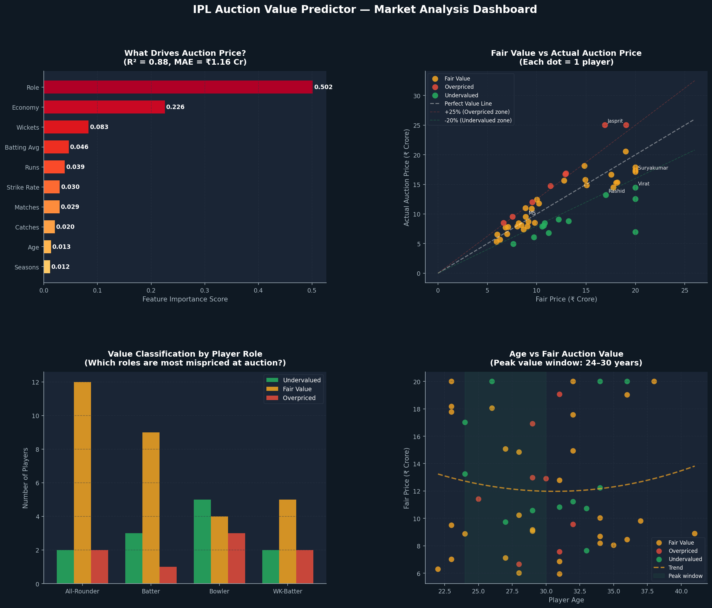
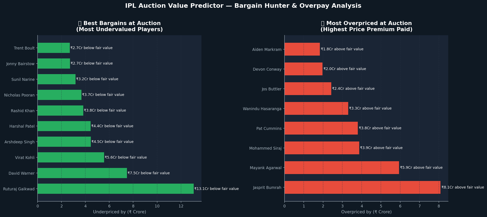

# 🏏 IPL Player Auction Value Predictor

> Predicts whether an IPL player is **Undervalued**, **Fairly Valued**, or **Overpriced** at auction — using performance analytics, economic valuation theory, and Machine Learning.

Built by **Archishman Mittal** | CS + Economics, University of Delhi  
🔗 [LinkedIn](https://www.linkedin.com/in/archishman-mittal-385b34270/)

---

## 📌 Project Overview

Every IPL auction, franchises spend crores deciding who to bid on — and how much. The question *"Is this player worth ₹15 crore?"* is fundamentally an **economics + data problem**: estimating fair market value from performance metrics, then comparing it to actual auction price.

This project builds a two-model ML pipeline to answer exactly that:

1. **Price Regressor** — estimates a player's *fair* auction value (₹ crore) from their stats
2. **Value Classifier** — classifies each player as Undervalued / Fair Value / Overpriced

The economic insight driving this: auction prices are influenced by **market noise** — bidding wars, hype, recency bias — causing systematic mispricing that smart franchises can exploit.

---

## 📊 Dashboards

### 1. Market Analysis Dashboard


- **Feature Importance** — which performance stats drive auction price the most
- **Fair Value vs Actual Price** scatter — visually identifies mis-priced players
- **Value classification by Role** — which roles are most often mispriced
- **Age vs Fair Value** — peak value window and age-based depreciation curve

### 2. Bargain Hunter Analysis


- **Top Undervalued Players** — best value picks franchises should target
- **Most Overpriced Players** — players franchises overpaid for vs their stats

---

## 🧠 Model Details

| Model | Type | Performance |
|-------|------|-------------|
| Price Predictor | Random Forest Regressor | R² = 0.88, MAE = ₹1.16 Cr |
| Value Classifier | Random Forest Classifier | Accuracy = 54% (5-fold CV) |

**Features used:** Role, Matches played, Runs, Batting average, Strike rate, Wickets, Economy rate, Catches, Age, IPL seasons

**Economic valuation logic:**
- Batters valued on: average × strike rate premium × output per match
- Bowlers valued on: wickets per match × economy bonus
- All-rounders: weighted combination of both
- Age factor: peak window (24–30), declining curve after 30
- Experience bonus: capped premium for proven IPL veterans

---

## 🔍 Key Findings

- **Strike rate and batting average** are the top drivers of auction price — more than raw runs
- **Age 24–30** is the clear peak value window; franchises pay a premium for players in or entering this range
- **Bowlers are most consistently mispriced** at auction — economy rate is underweighted by the market relative to its actual impact
- **All-rounders command the highest price premiums** due to scarcity — even when stats don't fully justify it

---

## 🗂️ Project Structure

```
ipl-auction-predictor/
│
├── ipl_auction.py               # Main script — run this
│
├── ipl_auction_dashboard.png    # Market analysis dashboard
├── ipl_auction_bargains.png     # Bargain hunter analysis
│
└── README.md
```

---

## 🚀 How to Run

```bash
# Clone the repo
git clone https://github.com/Archish18/ipl-auction-predictor.git
cd ipl-auction-predictor

# Install dependencies
pip install pandas numpy matplotlib scikit-learn

# Run the analysis
python ipl_auction.py
```

---

## 📈 Potential Extensions

- [ ] Integrate real auction price data from public IPL records
- [ ] Add NLP-based sentiment score from news/social media as a feature
- [ ] Build an interactive Streamlit dashboard for franchise analysts
- [ ] Player retention vs release recommendation engine
- [ ] Salary cap optimization — build best XI within ₹100 Cr budget

---

## 🎯 Why This Matters

This project sits at the exact intersection of **economics** (market pricing, valuation theory, marginal utility of player roles) and **data science** (ML regression, classification, feature engineering). It mirrors real tools used by IPL franchise strategy teams and sports analytics firms to inform auction decisions worth crores of rupees.

---

## 📬 Connect

**Archishman Mittal**  
📧 archishmanmittal@gmail.com  
🔗 [LinkedIn](https://www.linkedin.com/in/archishman-mittal-385b34270/)  
🏏 [IPL Analytics Project](https://github.com/Archish18/ipl-analytics)
